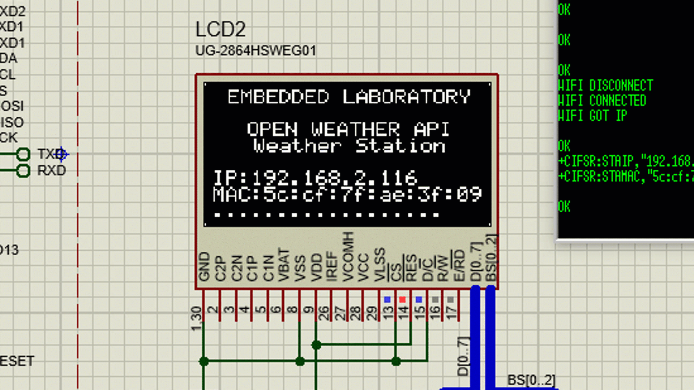

# Arduino Weather Station
This is based on Arduino Mega and OLED, with the help of ESP8266 WiFi Module. The following things are done in Software.
* Check whether the module is connected and working properly.
* Connect to a Network (Need SSID and Password)
* Get the MAC Address of the WiFi Module
* Get the Assigned IP Address to the module
* Connect with "OpenWeather" website
* Get temperature, real feel temperature, minimum temperature, and maximum temperature of any city and display this information on OLED display

### Software Libraries
Apart from standard Arduino libraries, there is one more library used which is for driving OLED display, and this library is from Rinky-Dink Electronics.
* Arduino Standard Library
* OLED_I2C Library from [Rinky-Dink Electronics](http://www.rinkydinkelectronics.com/library.php?id=79)

The following is the simulation view of the demo.

#### Software Flow
I will try to prepare a diagram to help in understanding in a better way, but for now, I am writing the text description.
- At Power-Up SW initializes the OLED Library and Serial Communication.
- Note: BaudRate of the module is changed to 9600 from 115200 because Proteus COMPIM doesn't support higher baud rates.
- Here the ESP8266 module is connected with the main Arduino UART, you can change it to your choice and update the SW accordingly.
- OLED is cleared and some default information is displayed.
- Arduino sends the "echo off" command to the module, this is done to prevent turning off echoing of the characters transmitted by Arduino.
- Arduino sends the "AT" command and checks for the **OK** response, if the response comes from the module, then SW will move further, else it will stay in the same state retrying until the valid response comes from the ESP8266 module.
- Arduino sends the command to change the mode to "Station Mode", here also the response from the module is checked, and if valid SW will move further else remain in the same state.
- Arduino will then send the command to join with the access point, and if connected SW will move further, else it will keep on retrying.
- Arduino will now send the command to get the assigned IP address and MAC address of the module, and the response is valid, Arduino SW will display this information on the OLED screen. Till this stage, our setup and initialization of the module are done.
- Now here comes the repetitive part, where we get the data of one city and display it on the OLED and then move to the next city.
- Arduino SW will connect with the "open weather" server, and once the connection is successful it will proceed further else keeps on retrying.
- Now Arduino SW will send the number of bytes command followed by the "GET" request for the selected city.
- Arduino will receive the data from the ESP8266 module and parse this data and display it on the OLED screen if this is valid.

Other Important Links:
* [Want to update the ESP8266 AT Firmware](https://www.youtube.com/watch?v=wXXXgaePZX8)
* [Introduction to some important AT Commands of ESP8266](https://www.youtube.com/watch?v=hP4YxjG9t3g)
* [Weather Station Based on Arduino & ESP8266 Using "OpenWeatherMap" API & AT Commands - OLED Based](https://www.youtube.com/watch?v=gWQxuI-oCUU)
* [Weather Station Based on Arduino & ESP8266 Using "OpenWeatherMap" API & AT Commands - TFT Based](https://www.youtube.com/watch?v=2BqeEwCSjyM)
